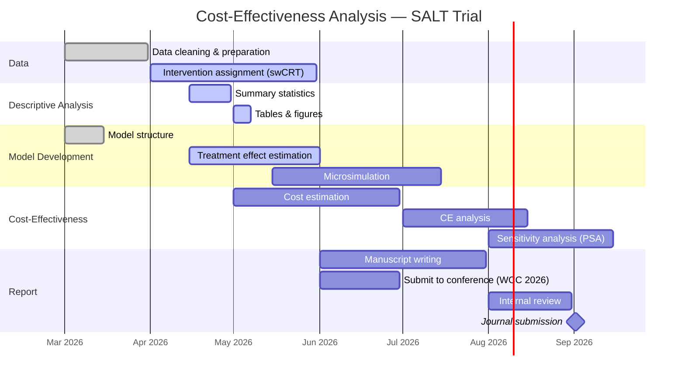

# Cost-effectiveness analysis of a salt substitute intervention in Northern Peru

This repo contains the code for the paper mentioned above. The data belongs to the CRONICAS Centre of Excellence in Chronic Diseases at the Universidad Peruana Cayetano Heredia (and the study participants) and is available upon reasonable request to its owners.

More content on this repo will be available soon.

## Project Timeline

