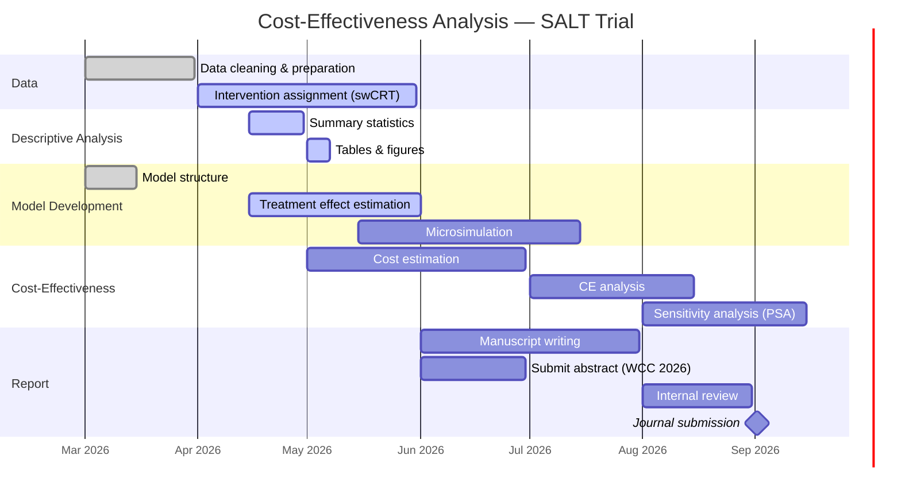

# Cost-effectiveness analysis of a salt substitute intervention in Northern Peru

This repo contains the code for the paper mentioned above. The data belongs to the CRONICAS Centre of Excellence in Chronic Diseases at the Universidad Peruana Cayetano Heredia (and the study participants) and is available upon reasonable request to its owners.

## Running the model

`run_microsim.R` is the entry point. It runs the base case, the one-way deterministic sensitivity analysis (OWSA) and the probabilistic sensitivity analysis (PSA), then caches everything to `output/cea_results.rds`. `salt_results.qmd` only reads that file — rendering the report never re-runs the model.

Two wrappers call the same entry point: `run_local.sh` for a workstation, `simulate.sbatch` for SLURM. The division of labour is that the cluster runs the model and the report is rendered locally.

### Locally

```bash
./run_local.sh                 # base case + OWSA + 1000-draw PSA (~25 min)
./run_local.sh --quick         # base case only (~5 s), for smoke tests
./run_local.sh -n 200 -r       # 200 PSA draws, then render the report
./run_local.sh -s 123 -o       # seed 123, skip the OWSA
```

| Flag | Effect | Default |
|---|---|---|
| `-n, --psa N` | PSA draws; `0` disables the PSA | 1000 |
| `-s, --seed N` | RNG seed | 42 |
| `-o, --no-owsa` | Skip the one-way pass | OWSA runs |
| `-q, --quick` | Shorthand for `--psa 0 --no-owsa` | — |
| `-r, --render` | Render `salt_results.qmd` after a successful run | no render |
| `--threads N` | BLAS/OpenMP threads | 1 |
| `-h, --help` | Flag reference | — |

Execute the script (`./run_local.sh`); do not `source` it. Sourcing skips the shebang, so bash-only syntax runs in your interactive shell — which on macOS is zsh — and leaks `set -euo pipefail` into that session. The script detects this and refuses.

The script resolves the repo root from its own location, so it works from any working directory. It preflights `Rscript`, the `here::i_am()` anchor and (with `-r`) `quarto` before starting, tees each run to `logs/microsim-<timestamp>.log`, and skips the render if the model exits non-zero.

Threads are pinned to 1 by default to match the cluster, so local and cluster results stay bit-comparable. `set.seed()` already fixes the RNG; the pinning is about BLAS floating-point reduction order.

The underlying entry point takes the same configuration through the environment, if you would rather skip the wrapper:

```bash
SALT_PSA_N=1000 SALT_OWSA=TRUE SALT_SEED=42 Rscript run_microsim.R
```

Flags passed to `run_local.sh` override these variables; a variable already set in the environment is used as the default when no flag is given.

### On SLURM

```bash
sbatch simulate.sbatch
```

Requests 2 CPUs, 8 GB and a 24-hour wall clock, with output in `logs/`. Edit the `--account`, `--partition` and `--mail-user` directives for your site. The script loads R 4.4.1 and activates a `quarto` conda environment, then runs the model with the defaults baked into `run_microsim.R` (full PSA). To change the run configuration, export the `SALT_*` variables in the job script before the `Rscript` line.

### Rendering the report

```bash
quarto render salt_results.qmd    # reads output/cea_results.rds, writes to reports/
```

### Tests

```bash
Rscript -e 'testthat::test_dir("tests")'
Rscript -e 'testthat::test_file("tests/test_microsim.R")'
```

## Project Timeline


```mermaid
gantt
    title Cost-Effectiveness Analysis — SALT Trial
    dateFormat  DD-MM-YYYY
    axisFormat  %b %Y

    section Data
    Data cleaning & preparation      :done,   data1, 01-03-2026, 31-03-2026
    Intervention assignment (swCRT)  :active, data2, 01-04-2026, 31-05-2026

    section Descriptive Analysis
    Summary statistics               :active, desc1, 15-04-2026, 30-04-2026
    Tables & figures                 :active, desc2, 01-05-2026, 07-05-2026

    section Model Development
    Model structure                  :done,   mod1, 01-03-2026, 15-03-2026
    Treatment effect estimation      :active, mod2, 15-04-2026, 01-06-2026
    Microsimulation                  :        mod3, 15-05-2026, 15-07-2026

    section Cost-Effectiveness
    Cost estimation                  :        ce1, 01-05-2026, 30-06-2026
    CE analysis                      :        ce2, 01-07-2026, 15-08-2026
    Sensitivity analysis (PSA)       :        ce3, 01-08-2026, 15-09-2026

    section Report
    Manuscript writing               :        rep1, 01-06-2026, 31-07-2026
    Submit abstract (WCC 2026)  :             rep2, 01-06-2026, 30-06-2026
    Internal review                  :        rep3, 01-08-2026, 31-08-2026
    Journal submission               :milestone, 01-09-2026, 1d
```

## Packages
- globorisk
- data.table